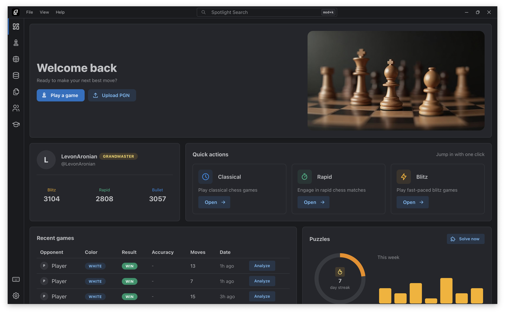
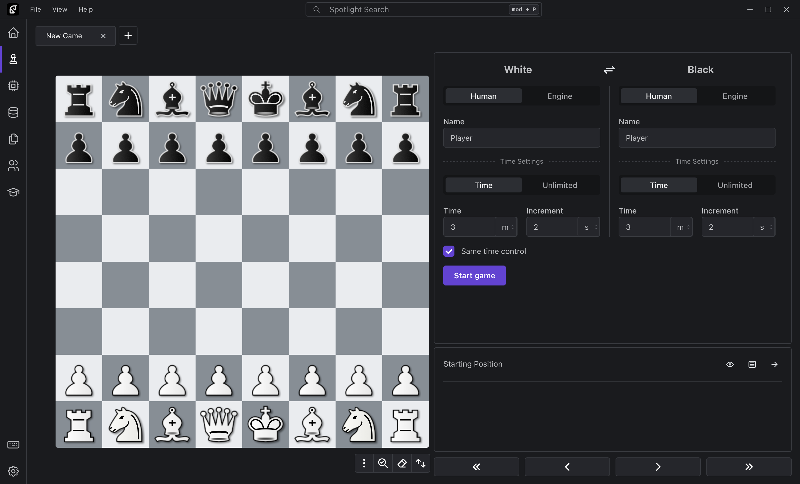
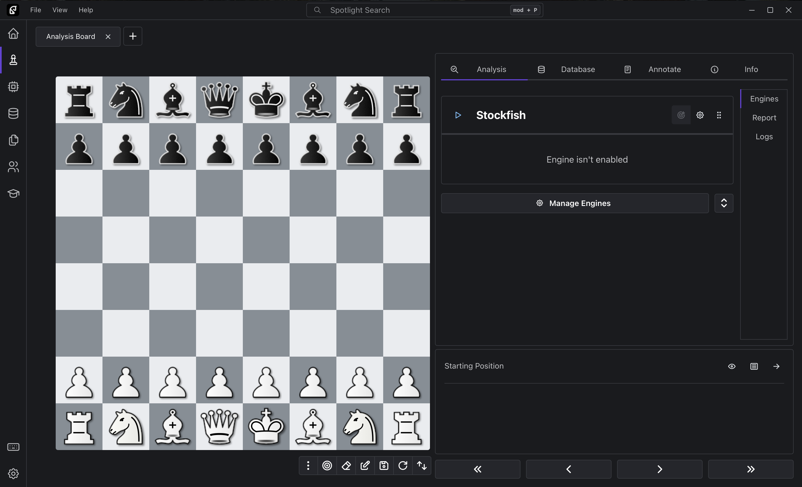
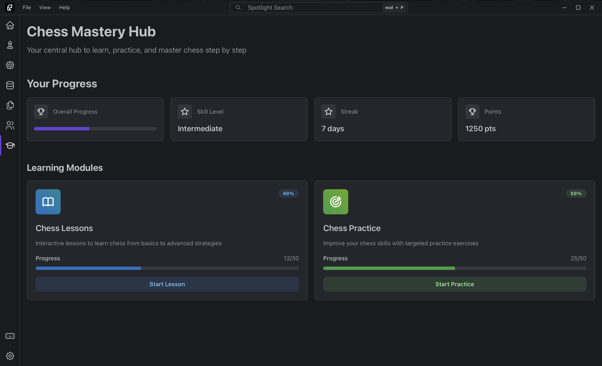
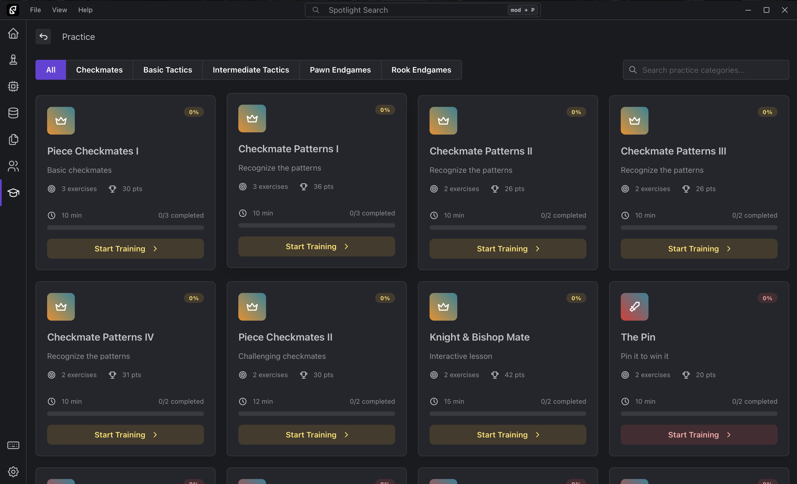
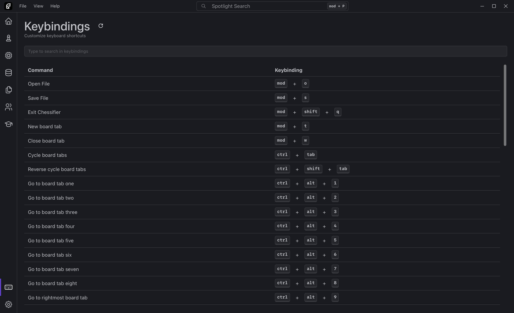
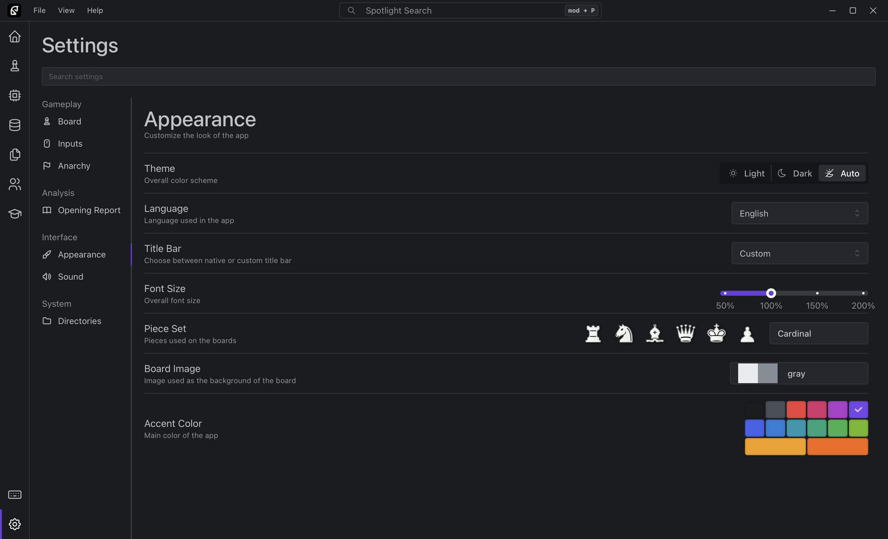

<br />
<div align="center">
<a href="https://github.com/ChessKitchen/pawn-appetit">
    
</a>

<h3 align="center">Pawn Appétit</h3>

<p align="center">
    The Ultimate Chess Toolkit
    <br />
    <br />
    <a href="https://pawnappetit.com/">Website</a>
    ·
    <a href="https://discord.gg/8hk49G8ZbX">Discord Server</a>
    ·
    <a href="https://github.com/ChessKitchen/pawn-appetit/releases">Releases</a>
</p>
</div>

Pawn Appétit is a modern, open-source, cross-platform chess GUI built for power users and enthusiasts. Designed to be intuitive, customizable, and feature-rich, it provides a seamless experience for analyzing games, training repertoires, and managing engines and databases.

## ✨ Features

- 🔍 Game Analysis - Import and analyze games from [lichess.org](https://lichess.org) and [chess.com](https://chess.com).
- ⚙️ Multi-Engine Support - Analyze with any UCI-compatible engine.
- 🧠 Repertoire Training - Build and train your opening repertoire using spaced repetition.
- 📦 Engine & Database Management - Install and manage engines and databases with minimal effort.
- 🔎 Position Search - Search for absolute or partial positions across your game database.

## 📸 Screenshots


Here are some screenshots of Pawn Appétit in action:

<div align="center">
  
  <br />
  <em>Dashboard Page</em>
  <br /><br />
  
  
  <br />
  <em>Game & Analyze Pages</em>
  <br /><br />
  
  
  <br />
  <em>Learn & Practice Pages</em>
  <br /><br />
  
  
  <br />
  <em>Keybindings & Settings Pages</em>
</div>

## 🚀 Getting Started

### Prerequisites
Ensure you have the required tools installed for your platform:
- [Tauri prerequisites](https://tauri.app/start/prerequisites/)
- [pnpm package manager](https://pnpm.io/)

### Build Instructions

1. **Clone the repository**:

   ```bash
   git clone git@github.com:ChessKitchen/pawn-appetit.git
   cd pawn-appetit
   ```

2. **Install dependencies using pnpm**:

   ```bash
   pnpm install
   ```

3. **Run in Development Mode**:

    Build and run the desktop application using Tauri:

    ```bash
    pnpm tauri dev
    ```

4. **Build for Production**:

    Build the application for production:

    ```bash
    pnpm tauri build
    ```

    The compiled application will be available at:

    ```bash
    src-tauri/target/release
    ```

### 🐳 Using Docker

You can also build Pawn Appétit using Docker (make sure [Docker](https://www.docker.com/) is installed and running):

1. **🏗️ Build the Docker image**:

   ```bash
   docker build -t pawn-appetit .
   ```

2. **🚀 Run the container**:

   ```bash
   docker run -d --name pawn-appetit-app pawn-appetit
   ```

3. **📦 Copy the built binary from the container**:

   ```bash
   docker cp pawn-appetit-app:/output/pawn-appetit ./pawn-appetit
   ```

The binary will be available in your current directory.

## 💻 Supported Platforms

Pawn Appétit currently supports the following desktop platforms:

| Platform | Supported Versions |
|----------|-------------------|
| Windows  | Windows 7 and above |
| macOS    | macOS 10.15 (Catalina) and above |
| Linux    | Distributions with webkit2gtk 4.1 (e.g., Ubuntu 22.04) |

## 📱 Planned Platform Support

We’re planning to bring Pawn Appétit to additional platforms in future releases:
- Android
- iOS
- Web Browser

## 🌍 Translations

<!-- TRANSLATIONS_START -->
| Language  | Status   | File                        |
|-----------|----------|-----------------------------|
| 🇺🇸 US | ✅ 100% | [US](./src/translation/en_US.ts) |
| 🇮🇹 IT | 🟡 98% | [IT](./src/translation/it_IT.ts) |
| 🇫🇷 FR | 🟡 81% | [FR](./src/translation/fr_FR.ts) |
| 🇦🇲 AM | 🟡 81% | [AM](./src/translation/hy_AM.ts) |
| 🇷🇺 RU | 🟡 81% | [RU](./src/translation/ru_RU.ts) |
| 🇧🇾 BY | 🟡 73% | [BY](./src/translation/be_BY.ts) |
| 🇩🇪 DE | 🟡 73% | [DE](./src/translation/de_DE.ts) |
| 🇪🇸 ES | 🟡 73% | [ES](./src/translation/es_ES.ts) |
| 🇳🇴 NO | 🟡 73% | [NO](./src/translation/nb_NO.ts) |
| 🇵🇱 PL | 🟡 73% | [PL](./src/translation/pl_PL.ts) |
| 🇵🇹 PT | 🟡 73% | [PT](./src/translation/pt_PT.ts) |
| 🇹🇷 TR | 🟡 73% | [TR](./src/translation/tr_TR.ts) |
| 🇺🇦 UA | 🟡 73% | [UA](./src/translation/uk_UA.ts) |
| 🇨🇳 CN | 🟡 73% | [CN](./src/translation/zh_CN.ts) |
| 🇯🇵 JP | 🔴 12% | [JP](./src/translation/ja_JP.ts) |
<!-- TRANSLATIONS_END -->

📢 Want to help translate? See [CONTRIBUTING_TRANSLATIONS.md](./CONTRIBUTING_TRANSLATIONS.md) and [CONTRIBUTING.md](./CONTRIBUTING.md).

## 📊 Telemetry

Pawn Appétit uses Supabase for anonymous telemetry to help improve the application. The telemetry collects:

- Application version and platform information (OS, version, and architecture)
- Anonymous user country code, detected locally or via a public IP geolocation API (`ip-api.com`)
- Basic usage events

No personal information, IP addresses, or game content are used for data collection. You can disable telemetry in the settings if preferred.

## 📦 Changelog

For a list of recent changes, see the [Changelog](./CHANGELOG.md).

## 🤝 Contributing

We welcome contributions! Please refer to the [Contributing Guide](./CONTRIBUTING.md) for details on how to get started.

## 💬 Community

Join our [Discord server](https://discord.gg/8hk49G8ZbX) to connect with other users, get help, and contribute to discussions.

## 🧱 About This Project

Pawn Appétit is a fork of [En Croissant](https://github.com/franciscoBSalgueiro/en-croissant), extended with additional features, refinements, and a focus on user experience.

